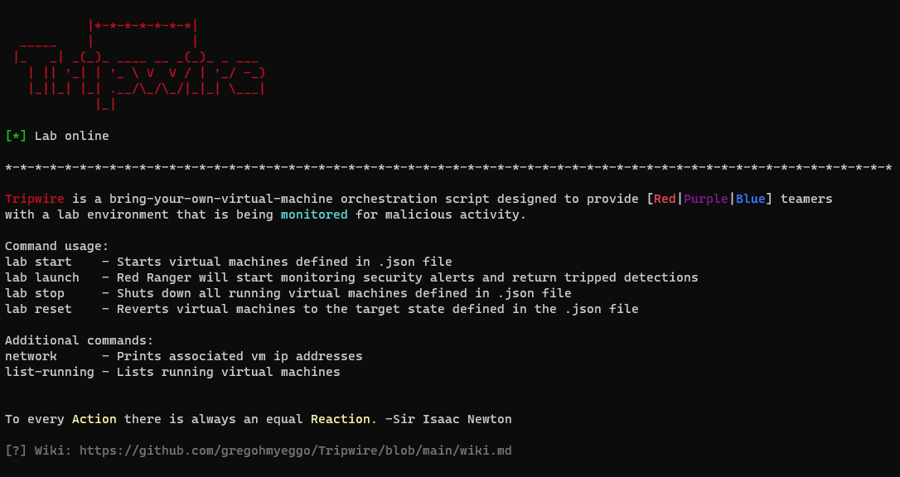

# Tripwire

Tripwire is designed to suppliment detection labs built in VMware Workstation to provide the user with additional methods to control the lab,
and also provides an additional interface to monitor alerts.

To every Action there is always an equal Reaction. -Sir Isaac Newton

