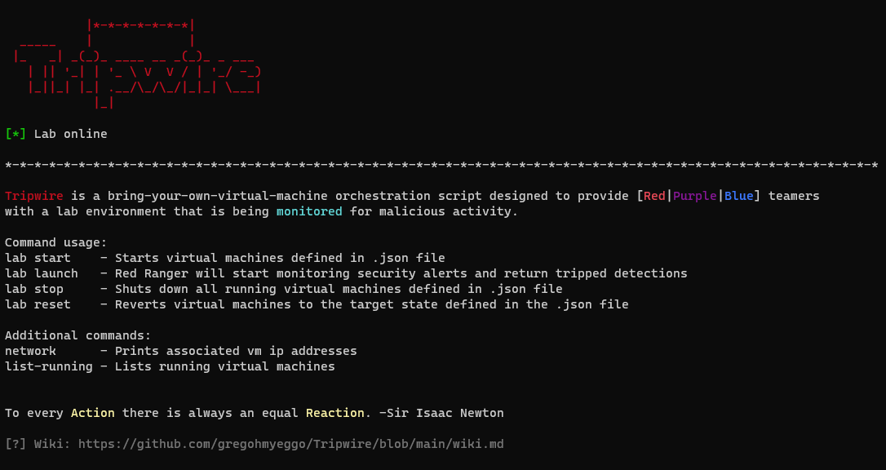
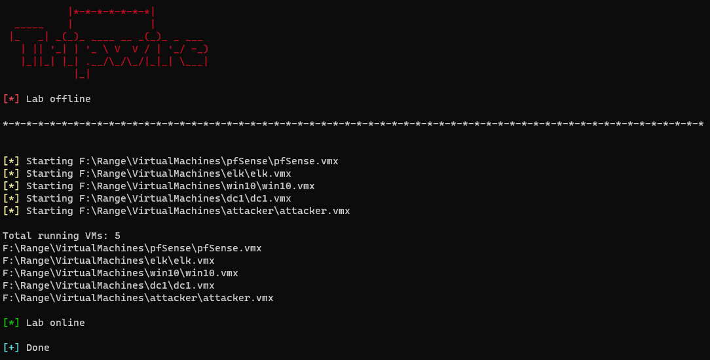
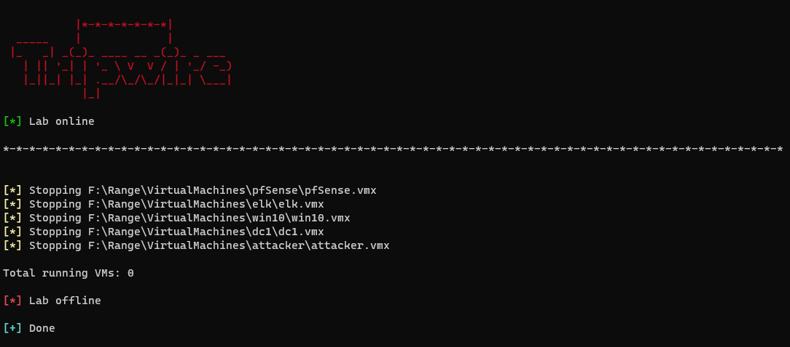
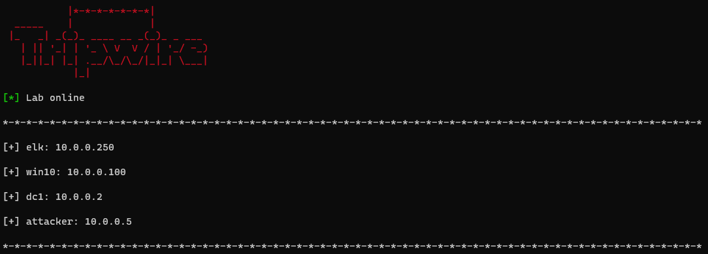
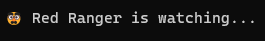

# Wiki

Tripwire is a "Bring-your-own-vm" orchestration script designed to provide a **monitored** environment for Red|Purple|Blue Team operators|analysts. 

It allows the user to:  
- quickly reset a testing environment 
- execute tradecraft as "Red Ranger" monitors the environment  
- practice building detections to alert on suspicious activity.

*To every Action there is always an equal Reaction* -Sir Isaac Newton



# Requirements  
- VMware Workstation
- ELK running on a virtual machine  
  - Configure an api token for "Red Ranger" to query the alert index
  - Add `xpack.encryptedSavedObjects.encryptionKey: "<32 character string>"` to kibana.yml for adding Detection rules  

# Lab example (this part is up to you)
- Windows 10 virtual machine (workstation)  
- Windows Server (domain controller)  
- pfSense virtual machine
  - Configure WAN/LAN segmentation
  - NAT port 5601/9200 to IP address of Elasticsearch virtual machine  

# Setup  
1) Updated `GLOBAL VERIABLES` in tripwire.ps1.  

2) Configure tripwire_environment.json with .vmx files of all the virtual machines configured in the environment. Once setup, take a snapshot of each machine named `<name>_reset` ; these snapshots will be used to reset the lab with `Lab reset` as needed.  

3) Unblock tripwire.ps1: `PS> Unblock-File .\tripwire.ps1`  

### tripwire_environment.json
TO-DO: Redo the .json file to be less rendundant. 
##### requirements
- VMware Workstation: installation directory
- environment.json: path to tripwire_environment.json
- VirtualMachines: list of each virtual machine and associated .vmx file

##### lab
- name: name of virtual machine
- vmx: path to vmx

##### scenarios
- name: name of virtual machine
- vmx: path to vmx
- snapshot: name of snapshot to revert to

```json
{
    "requirements": {
        "VMware Workstation": "<path to VMware Workstation>",
        "environment.json": "<path to tripwire_environment.json file>",
        "VirtualMachines": {
            "name": "<path to vmx>"
        }
    },
    "lab": [
        {
            "VirtualMachines":[
                {
                    "name": "<name>",
                    "vmx": "<path to vmx>"
                }
            ]
        }
    ],
    "scenarios": [
        {
            "name": "reset",
            "description": "Reset lab",
            "snapshots": [
                {
                    "name": "<name>",
                    "vmx": "<path to vmx>",
                    "snapshot": "<reset snapshot name>"
                }
            ]
        }
    ]
}
```

### Start Tripwire
```powershell
Import-Module .\Tripwire.ps1 -Force
Lab start
Lab launch
```

```powershell
Tutorial
```


```powershell
Lab start
```


```powershell
Lab stop
```


```powershell
Network
```


As the user adds Detect rules to ELK (or by importing a list of rules), executed tradecraft could fire an alert as the player enumerates and abuses the environment.  

  

*Emojis will only work with PowerShell 7; otherwise text-based options are displayed*
